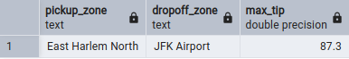

## Question 6 - Largest tip

>For the passengers picked up in October 2019 in the zone named "East Harlem North" which was the drop off zone that had the largest tip?
>
>_Note: it's tip , not trip_
>
>We need the name of the zone, not the ID.
>
>* Yorkville West
>* JFK Airport
>* East Harlem North
>* East Harlem South

## Solution

### Step 1:
Run [question_6.sql](question_6.sql) in pgadmin

### Final result:
