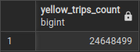

## Question 3

>How many rows are there for the Yellow Taxi data for all CSV files in the year 2020?
>- 13,537.299
>- 24,648,499
>- 18,324,219
>- 29,430,127

## Solution:

### Step 1: Schedule backfills for yellow taxi data during the period of 2020-01 - 2020-12

### Step 2: Navigate to pgAdmin, and run the following SQL command:

```sql
SELECT 
    COUNT(1) as yellow_trips_count
FROM yellow_tripdata
WHERE filename LIKE '%2020%'
```

### Final result:
