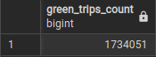

## Question 4

>How many rows are there for the Green Taxi data for all CSV files in the year 2020?
>- 5,327,301
>- 936,199
>- 1,734,051
>- 1,342,034

## Solution:

### Step 1: Schedule backfills for green taxi data during the period of 2020-01 - 2020-12

### Step 2: Navigate to pgAdmin, and run the following SQL command:

```sql
SELECT 
    COUNT(1) as green_trips_count
FROM green_tripdata
WHERE filename LIKE '%2020%'
```

### Final result:
