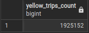

## Question 5

>How many rows are there for the Yellow Taxi data for the March 2021 CSV file?
>- 1,428,092
>- 706,911
>- 1,925,152
>- 2,561,031

## Solution:

### Step 1: Schedule backfills for yellow taxi data during the period of 2021-03-01 - 2020-03-31

### Step 2: Navigate to pgAdmin, and run the following SQL command:

```sql
SELECT 
    COUNT(1) as yellow_trips_count
FROM yellow_tripdata
WHERE filename LIKE '%2021-03%'
```

### Final result:
