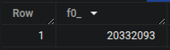

## Question 1 

>Question 1: What is count of records for the 2024 Yellow Taxi Data?
>- 65,623
>- 840,402
>- 20,332,093
>- 85,431,289

## Solution:

Run the following SQL query:

```sql
SELECT
  COUNT(1)
FROM
  totallyawesometaxidataset.ny_taxi_2024_data;
```

### Final result:
