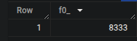

## Question 4

> How many records have a fare_amount of 0?
> 
>- 128,210
>- 546,578
>- 20,188,016
>- 8,333

## Solution:

Run the following SQL query:

```SQL
SELECT
  COUNT(1)
FROM
  totallyawesometaxidataset.ny_taxi_2024_data
WHERE
  fare_amount = 0
```

## Final Result:
