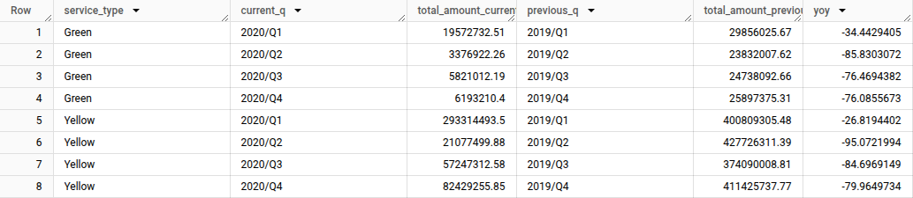

## Question 5

1. Create a new model `fct_taxi_trips_quarterly_revenue.sql`
2. Compute the Quarterly Revenues for each year for based on `total_amount`
3. Compute the Quarterly YoY (Year-over-Year) revenue growth

- e.g.: In 2020/Q1, Green Taxi had -12.34% revenue growth compared to 2019/Q1
- e.g.: In 2020/Q4, Yellow Taxi had +34.56% revenue growth compared to 2019/Q4

Considering the YoY Growth in 2020, which were the yearly quarters with the best (or less worse) and worst results for green, and yellow

- green: {best: 2020/Q2, worst: 2020/Q1}, yellow: {best: 2020/Q2, worst: 2020/Q1}
- green: {best: 2020/Q2, worst: 2020/Q1}, yellow: {best: 2020/Q3, worst: 2020/Q4}
- green: {best: 2020/Q1, worst: 2020/Q2}, yellow: {best: 2020/Q2, worst: 2020/Q1}
- green: {best: 2020/Q1, worst: 2020/Q2}, yellow: {best: 2020/Q1, worst: 2020/Q2}
- green: {best: 2020/Q1, worst: 2020/Q2}, yellow: {best: 2020/Q3, worst: 2020/Q4}

## Solution:

### Step 1:

Create new model by building [fct_taxi_trips_quarterly_revenue.sql](../../taxi_rides_ny/models/homework/fct_taxi_trips_quarterly_revenue.sql)

### Step 2:
Filter the result in BigQuery for the quarters we are interested in:

```sql
SELECT * FROM `totallyawesometaxiproject.dbt_mgeorgiev.fct_taxi_trips_quarterly_revenue` where current_q like '%2020%' order by 1,2
```

### Final result:
