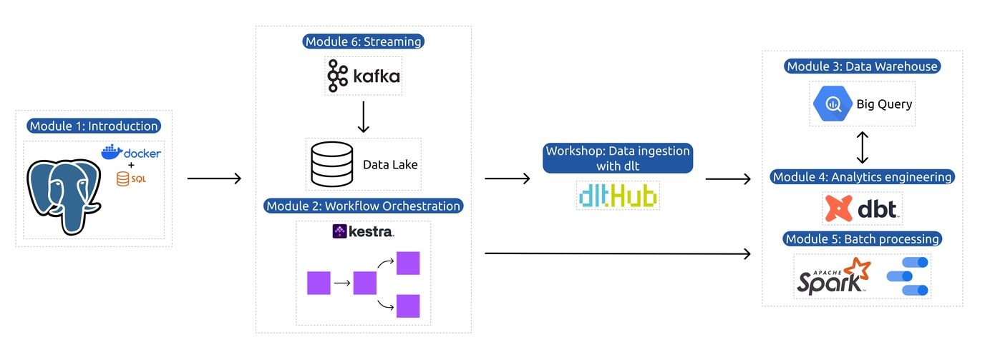

## <a href="https://github.com/DataTalksClub/data-engineering-zoomcamp/">Data Engineering Zoomcamp 2025</a>

Organized by <a href="https://datatalks.club/">DataTalks.Club</a>

Syllabus

* [Module 1: Containerization and Infrastructure as Code](#module-1-containerization-and-infrastructure-as-code)
* [Module 2: Workflow Orchestration](#module-2-workflow-orchestration)
* [Workshop 1: Data Ingestion](#workshop-1-data-ingestion)
* [Module 3: Data Warehouse](#module-3-data-warehouse)
* [Module 4: Analytics Engineering](#module-4-analytics-engineering)
* [Module 5: Batch processing](#module-5-batch-processing)
* [Module 6: Streaming](#module-6-streaming)
* [Project](#project)

## Taking the course

### 2025 Cohort 

* **Start**: 13 January 2025
* Materials specific to the cohort: [https://github.com/DataTalksClub/data-engineering-zoomcamp/tree/main/cohorts/2025](https://github.com/DataTalksClub/data-engineering-zoomcamp/tree/main/cohorts/2025)

### Self-paced mode

All the materials of the course are freely available, so that you
can take the course at your own pace

* Follow the suggested syllabus (see below) week by week
* You don't need to fill in the registration form. Just start watching the videos and join Slack
* Check [FAQ](https://docs.google.com/document/d/19bnYs80DwuUimHM65UV3sylsCn2j1vziPOwzBwQrebw/edit?usp=sharing) if you have problems
* If you can't find a solution to your problem in FAQ, ask for help in Slack

## Syllabus

We encourage [Learning in Public](learning-in-public.md)

> **Note:** NYC TLC changed the format of the data we use to parquet.
> In the course we still use the CSV files accessible [here](https://github.com/DataTalksClub/nyc-tlc-data).

### <a  href="https://github.com/DataTalksClub/data-engineering-zoomcamp/tree/main/01-docker-terraform">Module 1: Containerization and Infrastructure as Code</a>

* Course overview
* Introduction to GCP
* Docker and docker-compose
* Running Postgres locally with Docker
* Setting up infrastructure on GCP with Terraform
* Preparing the environment for the course
* Homework

### <a href="https://github.com/DataTalksClub/data-engineering-zoomcamp/tree/main/02-workflow-orchestration">Module 2: Workflow Orchestration</a>

* Data Lake
* Workflow orchestration
* Workflow orchestration with Kestra
* Homework

### <a href="https://github.com/DataTalksClub/data-engineering-zoomcamp/blob/main/cohorts/2025/workshops/dlt.md">Workshop 1: Data Ingestion</a>

* Reading from apis
* Building scalable pipelines
* Normalising data
* Incremental loading
* Homework

### <a href="https://github.com/DataTalksClub/data-engineering-zoomcamp/tree/main/03-data-warehouse">Module 3: Data Warehouse</a>

* Data Warehouse
* BigQuery
* Partitioning and clustering
* BigQuery best practices
* Internals of BigQuery
* BigQuery Machine Learning

### <a href="https://github.com/DataTalksClub/data-engineering-zoomcamp/tree/main/04-analytics-engineering">Module 4: Analytics engineering</a>

* Basics of analytics engineering
* dbt (data build tool)
* BigQuery and dbt
* Postgres and dbt
* dbt models
* Testing and documenting
* Deployment to the cloud and locally
* Visualizing the data with google data studio and metabase

### <a href="https://github.com/DataTalksClub/data-engineering-zoomcamp/tree/main/05-batch">Module 5: Batch processing</a>

* Batch processing
* What is Spark
* Spark Dataframes
* Spark SQL
* Internals: GroupBy and joins

### <a href="https://github.com/DataTalksClub/data-engineering-zoomcamp/tree/main/06-streaming">Module 6: Streaming</a>

* Introduction to Kafka
* Schemas (avro)
* Kafka Streams
* Kafka Connect and KSQL

### <a href="https://github.com/DataTalksClub/data-engineering-zoomcamp/tree/main/projects">Project</a>

Putting everything we learned to practice

* Week 1 and 2: working on your project
* Week 3: reviewing your peers

## Overview

### Prerequisites

To get the most out of this course, you should feel comfortable with coding and command line
and know the basics of SQL. Prior experience with Python will be helpful, but you can pick
Python relatively fast if you have experience with other programming languages.

Prior experience with data engineering is not required.

## Instructors

- [Victoria Perez Mola](https://www.linkedin.com/in/victoriaperezmola/)
- [Alexey Grigorev](https://linkedin.com/in/agrigorev)
- [Michael Shoemaker](https://www.linkedin.com/in/michaelshoemaker1/)
- [Zach Wilson](https://www.linkedin.com/in/eczachly)
- [Will Russell](https://www.linkedin.com/in/wrussell1999/)
- [Anna Geller](https://www.linkedin.com/in/anna-geller-12a86811a/)

 

Past instructors:

- [Ankush Khanna](https://linkedin.com/in/ankushkhanna2)
- [Sejal Vaidya](https://www.linkedin.com/in/vaidyasejal/)
- [Irem Erturk](https://www.linkedin.com/in/iremerturk/)
- [Luis Oliveira](https://www.linkedin.com/in/lgsoliveira/)

## Supporters and partners

Thanks to the course sponsors for making it possible to run this course

  

  

Do you want to support our course and our community? Please reach out to [alexey@datatalks.club](alexey@datatalks.club)