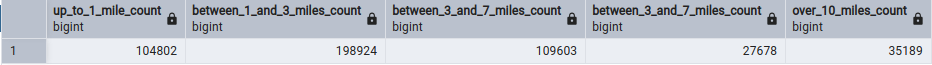

## Solution to question 3

### Step 1: 
Create [docker-compose.yaml](docker-compose.yaml)

### Step 2: 
Start the containers

_docker compose up (-d)_

## Step 3: 
Navigate to pgadmin Web UI via browser (localhost:8080)

## Step 4: 
Create a new db connection with credentials:

__Host name/address:__ _pgdatabase_

__Port:__ _5432_

__Username:__ _root_

__Password:__ _root_

### Step 5: 
Prepare scripts ([ingest_zone_lookup.py](ingest_zone_lookup.py), [ingest_green_trip_data.py](ingest_green_trip_data.py))

### Step 6: 
Create docker image for ingesting the zone lookup data with the following Dockerfile:

>FROM python:3.9  
RUN apt-get install wget  
RUN pip install pandas sqlalchemy psycopg2  
WORKDIR /app  
COPY ingest_zone_lookup.py ./  
ENTRYPOINT ["python", "ingest_zone_lookup.py"]

### Step 7:
Build the image:

_docker build -t ingest_zone_lookup:v001 ._

### Step 8:
Run the containerized script:

_docker run -it --network pg_network ingest_zone_lookup:v001 --username=root --password=root --host=pgdatabase --port=5432 --db=ny_taxi --table=taxi_zone_lookup --url="https://github.com/DataTalksClub/nyc-tlc-data/releases/download/misc/taxi_zone_lookup.csv"_

### Step 9: 
Create docker image for ingesting the green taxi trip data for October 2019 with the following Dockerfile:

>FROM python:3.9  
RUN apt-get install wget  
RUN pip install pandas sqlalchemy psycopg2  
WORKDIR /app  
COPY ingest_green_trip_data.py ./  
ENTRYPOINT ["python", "ingest_green_trip_data.py"]

### Step 9:
Build the image:

_docker build -t ingest_green_trips:v001 ._

### Step 10:
Run the containerized script:

_sudo docker run -it --network pg_network ingest_green_trips:v001 --username=root --password=root --host=pgdatabase --port=5432 --db=ny_taxi --table=green_taxi_data_2019_10 --url="https://github.com/DataTalksClub/nyc-tlc-data/releases/download/green/green_tripdata_2019-10.csv.gz"_

### Step 8: 
Run [question_3.sql](question_3.sql) in pgadmin

### Final result:

