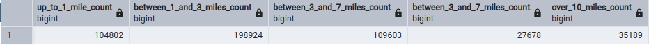

## Question 3 - Trip Segmentation Count

>During the period of October 1st 2019 (inclusive) and November 1st 2019 (exclusive), how many trips, respectively, happened:
>
>* Up to 1 mile
>
>* In between 1 (exclusive) and 3 miles (inclusive),
>
>* In between 3 (exclusive) and 7 miles (inclusive),
>
>* In between 7 (exclusive) and 10 miles (inclusive),
>
>* Over 10 miles  
>
>Answers:
>* 104,802; 197,670; 110,612; 27,831; 35,281
>* 104,802; 198,924; 109,603; 27,678; 35,189
>* 104,793; 201,407; 110,612; 27,831; 35,281
>* 104,793; 202,661; 109,603; 27,678; 35,189
>* 104,838; 199,013; 109,645; 27,688; 35,202

## Solution:

### Step 1: 
Create [docker-compose.yaml](docker-compose.yaml)

### Step 2: 
Start the containers

>_docker compose up (-d)_

## Step 3: 
Navigate to pgadmin Web UI via browser (localhost:8080)

## Step 4: 
Create a new db connection with credentials:

>__Host name/address:__ _pgdatabase_
>
>__Port:__ _5432_
>
>__Username:__ _root_
>
>__Password:__ _root_

### Step 5: 
Prepare scripts ([ingest_zone_lookup.py](ingest_zone_lookup.py), [ingest_green_trip_data.py](ingest_green_trip_data.py))

### Step 6: 
Create docker image for ingesting the zone lookup data with the following Dockerfile:

>FROM python:3.9  
RUN apt-get install wget  
RUN pip install pandas sqlalchemy psycopg2  
WORKDIR /app  
COPY ingest_zone_lookup.py ./  
ENTRYPOINT ["python", "ingest_zone_lookup.py"]

### Step 7:
Build the image:

>_docker build -t ingest_zone_lookup:v001 ._

### Step 8:
Run the containerized script:

>_docker run -it --network pg_network ingest_zone_lookup:v001 --username=root --password=root --host=pgdatabase --port=5432 --db=ny_taxi --table=taxi_zone_lookup --url="https://github.com/DataTalksClub/nyc-tlc-data/releases/download/misc/taxi_zone_lookup.csv"_

### Step 9: 
Create docker image for ingesting the green taxi trip data for October 2019 with the following Dockerfile:

>FROM python:3.9 
>
>RUN apt-get install wget 
>
>RUN pip install pandas sqlalchemy psycopg2 
>
>WORKDIR /app  
>
>COPY ingest_green_trip_data.py ./  
>
>ENTRYPOINT ["python", "ingest_green_trip_data.py"]

### Step 10:
Build the image:

>_docker build -t ingest_green_trips:v001 ._

### Step 11:
Run the containerized script:

>_sudo docker run -it --network pg_network ingest_green_trips:v001 --username=root --password=root --host=pgdatabase --port=5432 --db=ny_taxi --table=green_taxi_data_2019_10 --url="https://github.com/DataTalksClub/nyc-tlc-data/releases/download/green/green_tripdata_2019-10.csv.gz"_

### Step 12: 
Run [question_3.sql](question_3.sql) in pgadmin

### Final result:

